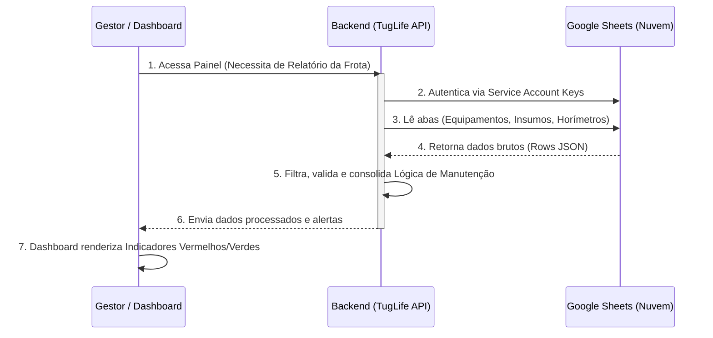

# TugLife OPS AI - Visão Geral, Arquitetura da DEMO e Integrações

**Autor:** Jossian Brito

Este documento visa explicar o funcionamento prático da versão de demonstração (DEMO) do **TugLife OPS AI**, ilustrando a arquitetura atual (que lê dados de arquivos CSV e mockups) e como a integração real e escalável utilizando o Google Sheets (planilhas na nuvem) acontecerá no ambiente de produção.

---

## 1. O Funcional da DEMO (Versão Atual)

A versão DEMO foi desenvolvida com foco na **Interface do Usuário (UI)** e nas **Regras de Negócio (Lógica)**. Ela demonstra os painéis de gestão, contagem de horas operacionais informadas nos *cards* de cada equipamento e cálculos visuais (barras de progresso).

Para funcionar de forma autônoma (sem necessitar de acessos externos), a DEMO baseia-se em:
1. **Dados Estáticos locais estruturados:** Arquivos como `custos_insumos.csv`.
2. **Dados em Memória (Mock):** Objetos em TypeScript que refletem a estrutura exata do que será buscado no servidor futuramente.
3. **Endpoint Preparatório:** O caminho `api/sheets` já existe e simula uma resposta de sucesso, deixando um local reservado no código para inclusão das chaves e senhas reais posteriormente.

---

## 2. Fluxograma de Arquitetura (DEMO vs Produção)

O fluxograma abaixo detalha o caminho percorrido pelas informações desde a base de dados até chegarem aos indicadores no Dashboard:

```mermaid
graph TD
    classDef demo fill:#f9f9f9,stroke:#333,stroke-width:2px,stroke-dasharray: 5 5
    classDef prod fill:#e1f5fe,stroke:#0288d1,stroke-width:3px
    classDef ui fill:#e8f5e9,stroke:#2e7d32,stroke-width:2px

    subgraph UI [Interface do Usuário - TugLife OPS]
        Dash[Dashboard Princial]:::ui
        Cards[Cards de Equipamentos]:::ui
        Progresso[Cálculo de Vida Útil %]:::ui
        Dash --> Cards
        Cards --> Progresso
    end
    
    subgraph Backend [Servidor Next.js]
        API_Sheets(Rotas Internas API - /api/sheets)
    end

    subgraph Data [Fontes de Dados]
        CSV[(CSV Locais\nex: custos_insumos)]:::demo
        Mock[(Dados Mockados\nex: Types, States)]:::demo
        GS[(Google Sheets\nNuvem)]:::prod
    end

    Progresso -- Consulta Parâmetros --> Backend
    Cards -- Requisita Detalhes --> Backend
    
    Backend -.-> |Na versão DEMO\n(Leitura Local)| CSV
    Backend -.-> |Na versão DEMO\n(Dados Memory)| Mock
    
    Backend ==>|Na Produção\n(Integração Ativa)| GS
```

---

## 3. O Fluxo de Trabalho Real (Integração Google Sheets)

O objetivo principal ao integrarmos uma planilha na nuvem (Google Sheets) é permitir que gestores ou equipe de bordo possam fazer edições numa ferramenta comum (como se fosse o Excel) que imediatamente altere as análises e decisões do sistema.

Abaixo, o diagrama demonstra como será a dinâmica quando substituirmos o `.csv` pela API em produção:



### Vantagens Desta Abordagem:
* **Edição Simples:** Uma troca de óleo concluída pode ser registrada apenas digitando a data na planilha no Google Sheets pelo celular do mestre/chefe de máquinas.
* **Transparência:** Cálculos pesados continuam dentro do sistema (Next.js), a planilha atua apenas como "banco de dados" simples.

---

## 4. Área de Refinamento (Para Avaliação do Usuário)

Como esse fluxo é personalizável e baseia-se diretamente na sua operação existente, preencha as solicitações ou defina melhorias abaixo. **Copie e responda no chat para que a IA ajuste a aplicação**:

1. **Quais colunas exatas sua planilha (Excel) de manutenção possui hoje?**
   > _Exemplo: "Nós controlamos por: Nome do Rebocador, Componente, Horas Atual, Data Última Revisão, Assinatura"._

2. **Como ocorre a atualização das informações (Lançamentos)?**
   > _Exemplo: "A equipe de bordo envia as horas todos os dias 18:00h" ou "Queremos que o APP da TugLife tenha um formulário para eles digitarem essas horas direto lá, e o próprio APP escreve na planilha do Sheets"._

3. **Qual fluxo visual gostaria de mudar no DEMO atual?**
   > _Exemplo: "As cores de alerta Vermelho/Amarelo devem estar mais evidentes na versão Mobile", ou "Preciso que os filtros separem automaticamente MCP Bombordo vs MCP Estibordo"._

4. **Regras de Alerta e Manutenção:**
   > _Sua margem de alerta é de 10% do tempo restante? Ou baseado em horas fixas?_

*(Sinta-se à vontade para ditar essas respostas diretamente no chat)*
